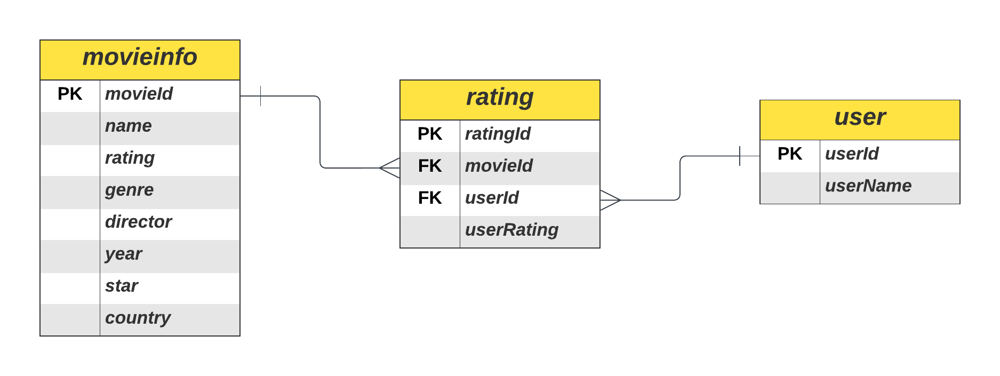

# 🎞 영화 추천 & 리뷰 \<Woovie\> ☂

# 1. 👩‍👩‍👧‍👦 팀원 소개

<table>
  <tbody>
    <tr>
      <td align="center">
         <a href=https://github.com/wild-turkey>
          
          <br /><sub><b> 김지훈 </b></sub>
        </a>
        <br />
      </td>
      <td align="center">
          <a href="https://github.com/woody6624">
          
          <br /><sub><b> 김우현 </b></sub>
        </a>
        <br />
      </td>
      <td align="center">
        <a href="https://github.com/yeejkim">
          
          <br /><sub><b> 김예진 </b></sub>
        </a>
        <br />
      </td>
      <td align="center">
        <a href="https://github.com/ssoyeonni">
          
          <br /><sub><b> 김소연 </b></sub>
        </a>
        <br />
      </td>
    </tr>
  </tbody>
</table>

# 2. ⚙ 기획

- 본 서비스 \<Woovie\>는 Woori와 Movie의 합성어로, 유저가 원하는 조건에 맞춘 영화 추천을 통해 더 나은 영화 경험 제공을 목표로 한다.
- 특히 **평점 관리**에 초점을 맞춰 **유저 본인이 작성한 평점** 및 **다른 유저가 작성한 평점**을 참고하여 영화 추천에 도움을 주도록 설계하였다.

# 3. 🔩 기능

- 유저
    1. 유저 등록 (Create)
    2. 유저 삭제 (Delete)
- 영화 조회
    1. 모든 영화 정보 조회 (Select)
    2. 특정 영화 정보 조회 (Select)
        - name, genre, director, country
- 리뷰 정보
    1. 특정 영화 리뷰 등록 (Create)
    2. 특정 영화 리뷰 수정 (Update)
    3. 특정 유저가 작성한 리뷰 조회 (Select)
    4. 특정 영화 리뷰 삭제 (Delete)

# 4. 🛠 설계

## 4-1. 개발 환경

- 프로그래밍 언어: Java, SQL
- IDE: Spring Tool Suite(STS)
- 데이터베이스: MySQL

## 4-2. Dataset

- Movie Industry
  
    - Kaggle Dataset 
    - 1986~2016년 사이 6820개의 IMDb 영화 데이터셋
    
    | 칼럼명 | 설명 | 데이터 타입 |
    | :---: | :---: | :---: |
    | name | 영화명 | object |
    | rating | 관람 등급 | object |
    | genre | 장르 | object |
    | year | 개봉 연도 | int64 |
    | released | 개봉 날짜 | object |
    | score | IMDb 점수 | float64 |
    | votes | IMDb 사용자 투표 수 | float64 |
    | director | 영화 감독 | object |
    | writer | 영화 작가 | object |
    | star | 영화 주연 | object |
    | country | 영화 제작국 | object |
    | budget | 예산 | float64 |
    | gross | 총 수익 | float64 |
    | company | 영화 제작사 | object |
    | runtime | 상영 시간 | float64 |
    - 위 데이터셋에서 name, rating, genre, director, year, star, country 총 7개의 칼럼을 선정하여 30개의 데이터 사용
    - movieinfo.csv 파일 사용
 
  - 데이터셋 출처
    - https://www.kaggle.com/datasets/danielgrijalvas/movies

## 4-3. ERD(**Entity Relationship Diagram)**



## 4-4. UML(**Unified Modeling Language)** Diagram


## 4-5. Directory Structure

```bash
src
├── movie
│   ├── controller
│   │   └── MovieController.java
│   │
│   ├── model
│   │   ├── Movie.java
│   │   ├── Rating.java
│   │   └── User.java
│   │
│   ├── dao
│   │   ├── MovieDAO.java
│   │   ├── RatingDAO.java
│   │   └── UserDAO.java
│   │
│   ├── service
│   │   └── MovieService.java
│   │ 
│   └── main
│       └── Main.java
├── util
│   └── DBUtil.java

```

- Controller
    - MovieController: 사용자 요청 처리 및 Model, View와 연결
- Model
    - Movie: Movie 클래스의 데이터 구조 정의
    - Rating: Rating 클래스의 데이터 구조 정의
    - User: User 클래스의 데이터 구조 정의
- dao
    - MovieDAO: movieinfo 데이터베이스와 상호작용
    - RatingDAO: rating 테이블 데이터베이스와 상호작용
    - UserDAO: user 테이블 데이터베이스와 상호작용
- Service
    - MovieService: 주요 Biz 처리
- Main
    - Main: 사용자 입력 요청 및 결과 출력
- Util
    - DBUtil: DB 연결 위한 공통 코드


# 5. 🧨 Trouble Shooting
### MySQL csv 파일 upload 
1. DBeaver에서 CSV파일을 불러온다. 


2. 원하는 데이터베이스를 선택하고 우클릭하여 데이터 가져오기를 선택한다.


3. CSV에서 가져오기를 선택하고 원하는 CSV 파일을 탐색기에서 설정한다.


4. 우측 상단의 Configure를 클릭하고 DB와 CSV의 열이 존재하는지 확인한다.


5. 진행을 눌러 마무리한다.


- 데이터가 잘 들어가 있음을 확인할 수 있다.

# 6. ✨ 고찰

- 김지훈
    - java를 처음 하는거라 자바의 기본적인 문법을 신경쓰면서도 효율적으로 코드를 짜는 방법에 대한 고민을 하는 것이 어려운 점이었습니다. 더불어 파일들 간의 유기적인 관계를 파악하는 것이 중요하다고 느꼈습니다. 또한 DB를 구성하는데 자료형과 csv를 가져오는 방법등 고려할 점이 많다는 점을 알게 되었습니다.
- 김우현
    - 스프링 부트를 통해 프로젝트를 여러가지 해본 경험이 있었지만 항상 이떄 database를 Spring data jpa와 applications.yml을 통해 간단하게 연결을 했었습니다. 하지만 이번에 sts를 이용해서 database와 연결하고 사용하는 과정을 통해 jpa에서 간단하게 사용하던 함수들의 내부구조에 대해 파악할 수 있게 되었고 또한 로우 레벨에서의 database연결의 구체적인 과정을 학습하게 되어서 한층 더 성장할 수 있었습니다.
- 김예진
    - Java로 프로젝트를 처음 진행해봤는데, 모든 경우의 수에 대해 생각하여 예외 처리를 해야 하는 부분이 어려웠습니다. 또한 어떻게 하면 효율적인 코드가 될지 고민하는 부분이 쉽지 않았지만, 그만큼 팀원들의 생각을 들으며 배운 부분도 많았습니다.
- 김소연
    - 자바 프로그램의 전반적인 흐름을 그려나가며 코드를 짜는 것이 완성도면에서 얼마나 중요한지 알 수 있었고, 기능 구현을 위한 코드를 작성하면서 전체 구조를 고려하는 법을 연습할 수 있었습니다. 또 완성되었다고 생각한 코드에서 가독성이 떨어지는 부분과 중복 코드들을 고쳐나가며 더 깔끔한 코드가 된 것을 눈으로 확인하니 리팩토링 과정과 코드 개선의 필요성을 직접 느낄 수 있었습니다. 그리고 git에 Pull Request를 처음 해봤는데 이 과정에서 발생한 충돌을 해결해 나가며 협업의 복잡성을 알게 되어 git을 더 공부하여 confilct 해결 능력을 길러야겠다고 생각이 들었습니다.
